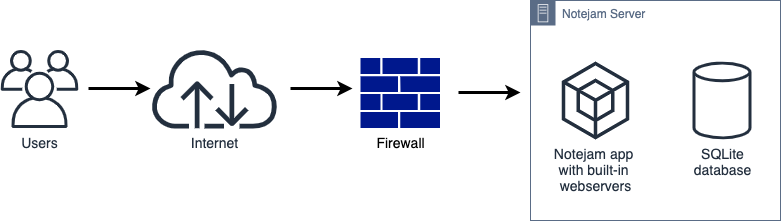
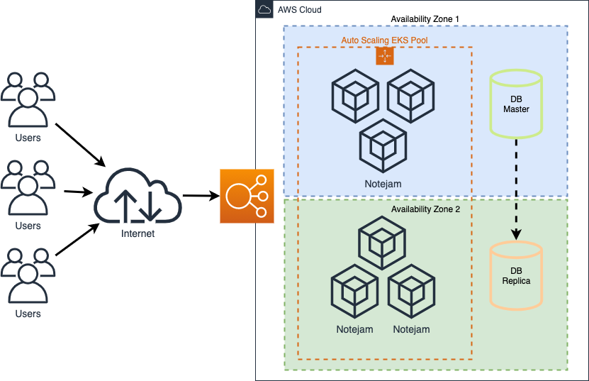
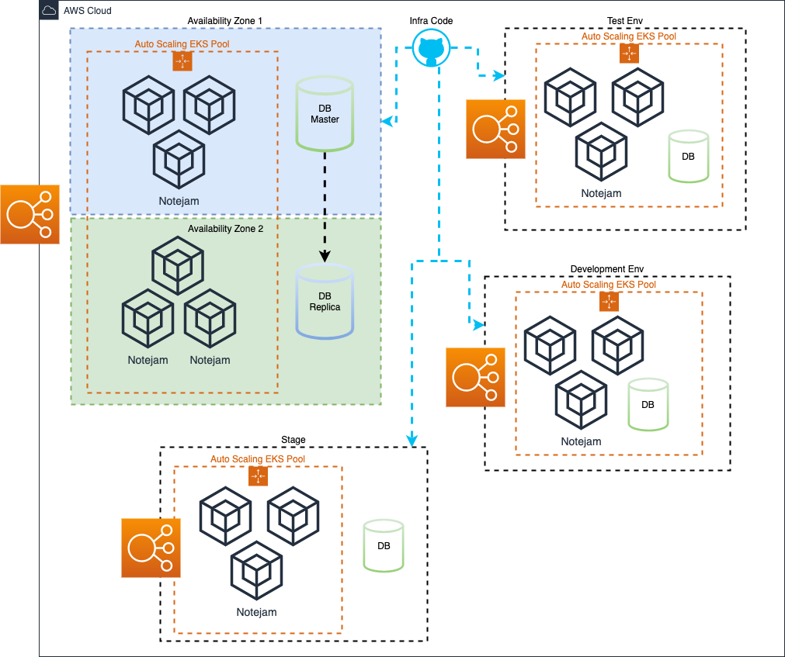
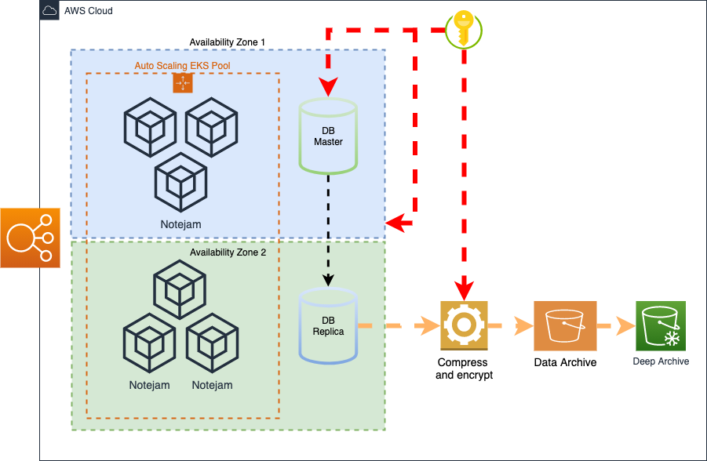
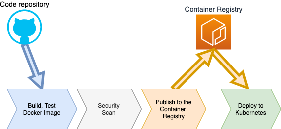

# Notejam 
> Application Infrastructure and processes

## 1. Objective

### Create a pilot for one of the company’s applications in public cloud
> 
> - The Application must serve variable amount of traffic. Most users are active during business hours. During big events and conferences the traffic could be 4 times more than typical.
> - The Customer takes guarantee to preserve your notes up to 3 years and recover it if needed.
> - The Customer ensures continuity in service in case of datacenter failures.
> - The Service must be capable of being migrated to any regions supported by the cloud provider in case of emergency.
> - The Customer is planning to have more than 100 developers to work in this project who want to roll out multiple deployments a day without interruption / downtime.
> - The Customer wants to provision separated environments to support their development process for development, testing, production in the near future.
> - The Customer wants to see relevant metrics and logs from the infrastructure for quality assurance and security purposes.

Let's redefine these requirements using slightly different terms

1. **Scalability / Autoscaling** - application must be able to scale up and down more than 4 times
2. **Data retention** - we have to create application data backups and store them for 3 years
3. **High Availability** - service must operate in case of datacenter failure
4. **Disaster Recovery** - Restore service operation in other geographical region supported by cloud provider
5. **CI / CD** - roll out multiple deployments a day without interruption / downtime of service
6. **Infrastructure as Code** - deploy multiple environments from the same Infrastructure Code
7. **Logging and monitoring** - metrics and logs from the infrastructure for quality assurance and security purposes
8. **Secrets Management** - sensitive information like database password, encryption keys, etc must be stored using secured way *(recommended)

And then let’s define our technical requirements

## 2. Technical requirements and design

1. Ensure application can be **scaled horizontally** 
2. **Infrastructure code** to create auto-scalable cloud infrastructure available within multiple datacenters (availability zones)
3. **Backup process** - dump, compress, encrypt and upload to the cloud storage database dump. Ensure defined retention policy. 
4. **Disaster recovery process** - recreate infrastructure and restore application and data from archive.
5. **Logging and monitoring** - collect all logs, events and metrics from application and related infrastructure. Define baselines and create alert rules.
6. **CI / CD** - Build test and deploy application automatically on repository trigger or manually. Store Application Artifacts 

Based on the application requirements we may have something like Pic. 2.1



### 2.1 Cloud Provider
- [x] AWS
- [ ] Azure
- [ ] Google Cloud

### 2.2 Tools
[Docker](https://www.docker.com/) 
  - Allows you to deliver your application together with application and OS requirements. 
  - Run it locally or in the cloud within the same runtime environment. 
  - Can extremely simplify application build and deploy processes.

[Kubernetes](https://kubernetes.io/docs/concepts/overview/what-is-kubernetes/)
  - Easy provide application availability with simple health-check
  - Easy provide auto scaling for application containers
  - Easy implement application deploy with minimum downtime
  - Easy manage application releasing process

### 2.3 Application requirements

To run Notejam app in the cloud and make it scalable we have to implement:
- Dockerize 
- Application container must be stateless (replace local DB with shared)
- Define health-check url
- Define Kubernetes manifests

At the same time with any other approach we still need to implement most of the items

## 3. Implementation stages

### 3.1 Application
[Notejam](https://github.com/aaheiev/notejam) - Modified Ruby On Rails application with Redis and PostgreSQL as backend

Modifications required
  - [x] dockerize application (Dockerfile)
  - [x] run development version on local desktop (docker-compose) 
  - [x] migrate DB from SQLite to PostgreSQL
  - [x] move session storage to shared cache (Redis)
  - [x] add versioning
  - [x] ensure healthcheck and minimum required resources

### 3.2 Cloud infrastructure design and provision 
- [x] EKS (managed Kubernetes cluster) within multiple availability zones and auto-scaling
- [ ] Ingress controller with TLS termination
- [ ] PostgreSQL provisioning
- [ ] Redis provisioning
- [x] Application deploy to Kubernetes
- [x] Autoscaling and high availability for application container in Kubernetes 
(installer to deploy application with minimum 2 replicas and CPU-based auto-scaling)
  - [x] Define application resource profile (requests and limits for cpu and memory usage)
  - [x] Ensure Kubernetes cluster autoscaling
  - [x] Ensure application autoscaling
- [x] Multiple environments (apply code to clone infrastructure with different set of vars)
- [ ] Monitoring and logging (collect all metrics and logs. create diagrams and filters for logs and metrics)
- [ ] Secret management


Infrastructure code and instructions located in [this repository](https://github.com/aaheiev/notejam-infra)

### 3.3 Cloud infrastructure processes 
- [ ] Backup and disaster recovery process
  - Dump, compress, encrypt and archive to cloud storage application data
  - Create storage rules for data retention
  - Restore and check archive consistency



### 3.4 CI/CD and development infrastructure



- [x] Build, test, create docker image
- [x] Security scan docker image
- [x] Publish docker image to container registry
- [x] Release (rollout) new application version

#### Dev Infra
During development lifecycle usually we need to have more than one application environment (DEV,QA,UAT)
and not always we must use a production-like database layer. 
For such cases we could use dockerized version of database layer

- [x] Deploy PostgreSQL to Kubernetes
- [x] Deploy Redis to Kubernetes
- [ ] Run Integration / acceptance / load testing

## 4. Run application in AWS cloud

### 4.1 Software requirements

Before run the code ensure if following software installed on your computer:
- docker
- aws-cli
- terraform
- kubernetes-cli
- helm

### 4.2 AWS access

run following command to configure aws command line access

```shell script
aws configure
```

### 4.3 Build and run application locally

Checkout application from [this repo](https://github.com/aaheiev/notejam)
and from the project's root run

```shell script
docker-compose up -d
```
Notejam application must be available by address [http://127.0.0.1:3000](http://127.0.0.1:3000)
  
### 4.4 Build and publish docker image
- Create ECR repo
From AWS management console open ECR service and create new repository **notejam**

Your repo url is
```
XXXXXXXXXXXX.dkr.ecr.eu-west-1.amazonaws.com/notejam
```
where XXXXXXXXXXXX is your aws account id

- Log in ECR
```shell script
aws ecr get-login-password --region eu-west-1 | docker login \
  --username AWS \
  --password-stdin XXXXXXXXXXXX.dkr.ecr.eu-west-1.amazonaws.com
```

- Build docker image 
```shell script
docker build -t notejam .
```
- Tag image
```shell script
docker tag notejam:latest XXXXXXXXXXXX.dkr.ecr.eu-west-1.amazonaws.com/notejam:latest
```
- Publish image
```shell script
docker push XXXXXXXXXXXX.dkr.ecr.eu-west-1.amazonaws.com/notejam:latest
```

### 4.5 Provision cloud infrastructure
Configure variables for the new environment
create _${env_name}.tfvars_ file in the vars sub-folder

_./vars/demo.tfvars_
```
env_name = "demo"
```
init terraform project
```shell script
terraform init
```

plan and apply terraform code

```shell script
terraform plan -var-file="./vars/demo.tfvars"
```

```shell script
terraform apply -var-file="./vars/demo.tfvars"
```
copy **kubeconfig_filename** file to **~/.kube/config**

### 4.6 Install Notejam

#### Configure HELM variables for PostgreSQL and Notejam.

Copy content of **example** dir to the new name in the same level.
Edit passwords and session key and account id in container registry url

_./environments/demo/postgres.yaml_
```yaml
---
secrets:
  POSTGRES_PASSWORD: xxxxxxxxxxxxxxxx
```

_./environments/demo/notejam.yaml_
```yaml
---
secrets:
  APP_SESSION_KEY:   xxxxxxxxxxxxxxxxxxxxxxxxxxxxxxxx
  DB_PASS:           xxxxxxxxxxxxxxxx

image:
  repository:        xxxxxxxxxxxx.dkr.ecr.eu-west-1.amazonaws.com/notejam
```
 
#### Install helm charts

Install PostgreSQL
```shell script
helm upgrade --install -n demo --create-namespace --wait \
  -f ./environments/demo/postgres.yaml postgres ./helm/postgres
```

Install Redis
```shell script
helm upgrade --install -n demo --create-namespace --wait \
  redis ./helm/redis
```

Install Notejam
```shell script
helm upgrade --install -n demo --create-namespace --wait \
  -f ./environments/demo/notejam.yaml notejam ./helm/notejam
```

Run command to get public load balancer address

```shell script
kubectl -n demo get svc notejam
``` 
